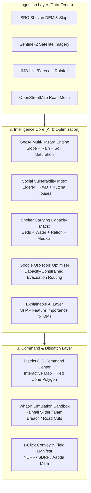

# 🛡️ ResQGrid: Master Implementation & Architecture Guide
**Team BharatBytes | Smart India Hackathon 2026**  
**Problem Statement ID:** `SIH26191`  
**Theme:** Disaster Management | **Category:** Software  

---

## 📌 Executive Summary
**ResQGrid** is an AI-powered proactive relocation intelligence system designed to eliminate chaotic evacuations during climate disasters (landslides, flash floods, cloudbursts). It dynamically identifies hazard red zones, tracks multi-resource carrying capacity across relief shelters, and calculates optimal, capacity-constrained relocation plans in under 2 minutes using mathematical optimization (MILP).

---

## 🔍 1. Problem Statement Deconstruction (SIH26191)

| Problem Element | Ground Reality & Bottleneck | ResQGrid Solution |
| :--- | :--- | :--- |
| **Hazard-Based Red Zones** | Static hazard maps fail during cloudbursts or flash floods. Authorities receive warnings too late to evacuate safely. | **Dynamic GeoAI Raster Engine**: Real-time fusion of Digital Elevation Models (DEM), slope gradients, soil moisture, and live IMD rainfall forecasts. |
| **Carrying Capacity Assessment** | Relief shelters are treated as simple "bed counts", leading to water/food stockouts and medical emergencies. | **Multi-Resource Capacity Degradation Model**: Dynamically evaluates beds, drinking water ($L/day$), ration endurance ($days$), medical staff, and sanitation limits. |
| **Immediate Relocation Needs** | Evacuations are chaotic; high-risk habitations get stranded, buses take flooded roads, and shelters get overwhelmed. | **Mixed-Integer Linear Programming (MILP)**: Generates mathematically optimal evacuation manifests with zero shelter overflow, prioritized by demographic vulnerability. |

---

## 🏗️ 2. High-Level System Architecture



---

## 📐 3. Mathematical Models & Technical Modules

### Module 1: GeoAI Hazard Risk Scoring ($H_i$)
Every habitation/grid cell $i$ is assigned a dynamic hazard score $H_i \in [0, 1]$ computed as:
$$H_i = w_s \cdot \text{Slope}_i + w_r \cdot \text{Rainfall}_i(t) + w_m \cdot \text{SoilMoisture}_i + w_e \cdot \text{ElevGradient}_i$$
* **Red Zone Threshold:** $H_i \ge 0.70$ (Immediate Mandatory Evacuation)
* **Orange Zone Threshold:** $0.40 \le H_i < 0.70$ (Pre-evacuation Standby)
* **Green Zone Threshold:** $H_i < 0.40$ (Safe / Low Risk)

### Module 2: Social Vulnerability Index (SoVI - $V_i$)
To ensure the most vulnerable citizens are evacuated first:
$$V_i = \frac{\text{Elderly} + \text{Infants} + 2 \times \text{PwD} + \text{Kutcha Houses}}{\text{Total Population}_i}$$
$$\text{Priority Score } P_i = H_i \times (1 + \alpha V_i)$$

### Module 3: Shelter Carrying Capacity ($C_j$)
A shelter $j$'s true capacity is the minimum of its available resource thresholds:
$$C_j(t) = \min \left( \text{Beds}_j, \frac{\text{WaterSupply}_j (L)}{\text{WaterPerPerson/Day} \times \text{Days}}, \frac{\text{RationUnits}_j}{\text{RationPerPerson/Day} \times \text{Days}}, \text{SanitationCap}_j \right)$$

### Module 4: MILP Evacuation Optimization (Google OR-Tools)
* Let $x_{ij}$ be the number of people relocated from Habitation $i$ to Shelter $j$.
* Objective: Minimize total risk-weighted travel time/distance:
$$\min \sum_{i} \sum_{j} x_{ij} \cdot \text{Distance}_{ij} \cdot (1 - \text{SafetyFactor}_{ij})$$
* **Subject to Constraints:**
  1. **Demand Satisfaction:** $\sum_{j} x_{ij} = \text{Population}_i \quad \forall i \in \text{Red Zones}$
  2. **Zero Shelter Overflow:** $\sum_{i} x_{ij} \le C_j \quad \forall \text{Shelters } j$
  3. **Road Safety:** $x_{ij} = 0$ if $\text{RoadStatus}_{ij} = \text{Severed/Submerged}$

---

## 👥 4. Team BharatBytes: Role & Responsibility Allocation

| Team Member Role | Focus Area | Key Deliverables |
| :--- | :--- | :--- |
| **Team Lead / System Architect** | System integration, problem alignment & pitch | End-to-end architecture, API integration, hackathon defense & jury Q&A. |
| **AI / ML & Geospatial Engineer** | Hazard scoring, SoVI modeling & Explainability | GeoPandas raster pipeline, XGBoost/Risk index scoring, SHAP explainability. |
| **Optimization & Backend Engineer** | Google OR-Tools & FastAPI Backend | Mixed Integer Linear Programming (MILP) solver, API endpoints, capacity logic. |
| **GIS & Frontend Developer** | Command Center UI & Mapbox/Leaflet | Interactive dark-mode dashboard, dynamic zone overlays, shelter gauge cards. |
| **Simulation & Data Specialist** | "What-If" engine & realistic datasets | Rainfall slider simulation, road severance triggers, realistic test district dataset. |
| **Field Ops & UI/UX Specialist** | Convoy dispatch & presentation collateral | Dispatch sheets, field mobile view, PPT polishing, infographic workflows. |

---

## 🧪 5. Step-by-Step Implementation Roadmap

```
[Step 1: Mock Data & District Geospatial Engine]
  ├── Define Habitations (Coordinates, Population, Demographics, Vulnerability)
  ├── Define Shelters (Capacity, Water, Food, Medical, Lat/Long)
  └── Define Road Network Mesh (Distances, Elevation, Flood Inundation status)

[Step 2: Core Optimization Backend (FastAPI + OR-Tools)]
  ├── /api/hazard-zones (Computes dynamic Red/Orange/Green zones)
  ├── /api/shelters/carrying-capacity (Computes dynamic resource limits)
  ├── /api/relocate/optimize (Runs MILP solver with Google OR-Tools)
  └── /api/simulate/what-if (Applies rain/dam breach/road blockage adjustments)

[Step 3: District Command Center Frontend (React + Tailwind + Leaflet)]
  ├── Real-time Map with Interactive Layer Controls (Red Zones, Routes, Shelters)
  ├── Shelter Health Gauges (Live bed/water/food tracking)
  ├── Live What-If Slider Bar (Rainfall intensity, Dam discharge)
  └── Evacuation Dispatch Manifest Generator (1-click export)

[Step 4: Hackathon Pitch & Presentation Polish]
  ├── Polish PPT slides (Ensure team name & problem statement consistency)
  └── Practice live 3-minute pitch & live disaster simulation defense
```

---

## 🏆 6. How We Win Over the SIH Jury

1. **Not a static prototype**: When the jury asks *"What if 200mm rain falls and Bridge A collapses?"*, we move the slider live on the screen and show the MILP solver re-routing 1,500 people to Shelter C with zero shelter overflow in under 1 second.
2. **DM-Grade Explainable AI (XAI)**: We show the exact feature contribution (Slope 45%, Rain 35%, Soil 20%) so the District Magistrate understands the rationale.
3. **True Carrying Capacity**: We demonstrate that a shelter with 500 beds but only 200 rations/day will cap at 200, preventing disaster-within-a-disaster situations.
