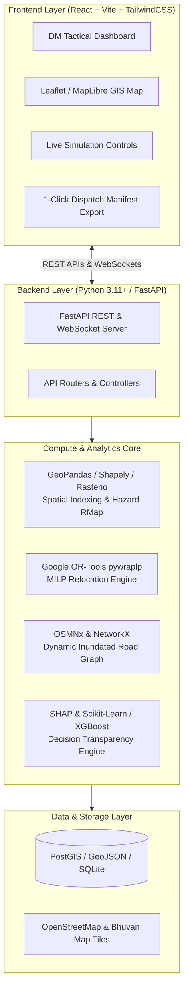

# 💻 ResQGrid: Complete Software Architecture & Implementation Guide
**Team BharatBytes | Smart India Hackathon 2026**  
**Problem Statement ID:** `SIH26191`  
**Theme:** Disaster Management | **Category:** Software  

---

## 📑 Table of Contents
1. [End-to-End Software Tech Stack](#1-end-to-end-software-tech-stack)
2. [Software Architecture & Data Flow Pipeline](#2-software-architecture--data-flow-pipeline)
3. [Software Modules & How Each Library is Used in Code](#3-software-modules--how-each-library-is-used-in-code)
4. [Backend API Endpoints (FastAPI)](#4-backend-api-endpoints-fastapi)
5. [Frontend GIS Command Dashboard (React + Leaflet)](#5-frontend-gis-command-dashboard-react--leaflet)
6. [Data Structures & Schemas (Pydantic / JSON)](#6-data-structures--schemas-pydantic--json)
7. [Offline & Field Ops Capabilities (Low-Bandwidth / SMS / Manifests)](#7-offline--field-ops-capabilities)

---

## 1. End-to-End Software Tech Stack



| Component | Software / Library | Version | Why We Use It | How It Is Used in the Project |
| :--- | :--- | :--- | :--- | :--- |
| **Backend Framework** | `FastAPI` | `0.110+` | Asynchronous, sub-millisecond latency, automatic OpenAPI docs, native Pydantic validation. | Exposes all simulation, red-zone calculation, shelter tracking, and optimization endpoints to the frontend. |
| **Mathematical Solver** | `Google OR-Tools` (`pywraplp`) | `9.8+` | Industrial-grade Mixed-Integer Linear Programming (MILP) solver; finds mathematically optimal solutions in $< 200\text{ms}$. | Formulates and solves the zero-overflow capacity-constrained evacuation matrix ($x_{ij}$). |
| **Geospatial Processing** | `GeoPandas`, `Shapely`, `Rasterio` | `0.14+` | Industry standard for vector & raster spatial data manipulation in Python. | Ingests DEM elevation tiles, calculates slope gradients, buffers hazard zones, and performs point-in-polygon checks for habitations. |
| **Road Network & Routing** | `OSMNx`, `NetworkX` | `1.9+` | Downloads and constructs routable graph networks from OpenStreetMap data. | Builds the district road graph, dynamically penalizes/removes flooded edges, and computes shortest safe distances. |
| **Machine Learning & XAI** | `XGBoost`, `SHAP`, `Scikit-Learn` | `1.7+` | High-performance gradient boosting + game-theoretic model explainability. | Predicts landslide/flood risk scores from environmental features and generates Shapley waterfall plots for District Magistrates. |
| **Frontend Framework** | `React.js` (`Vite`) + `TailwindCSS` | `18+` | Rapid state reactivity, modular components, responsive dark-mode styling. | Renders the District Disaster Management Command Center with live updating widgets, metrics, and cards. |
| **Interactive GIS Mapping** | `Leaflet` / `React-Leaflet` | `1.9+` | Lightweight, open-source mapping engine supporting custom GeoJSON layers and animations. | Displays dynamic Red/Orange/Green hazard polygons, shelter pins with live capacity gauges, and color-coded evacuation convoys. |
| **Data Serialization** | `Pydantic v2` | `2.6+` | Strict type checking, data parsing, and JSON serialization. | Validates all incoming simulation payloads, habitation demographics, and shelter telemetry. |

---

## 2. Software Architecture & Data Flow Pipeline

1. **Ingestion & Grid Generation:**
   * Raw Digital Elevation Model (DEM) rasters and IMD rainfall intensity feeds are parsed via `Rasterio` and `GeoPandas`.
   * Habitations are represented as spatial feature points with demographic attributes (elderly, infants, PwD, kutcha house counts).
2. **Hazard Evaluation Trigger:**
   * When live rainfall telemetry updates or when a user adjusts the **What-If Simulation Slider**, the `/api/hazard/evaluate` endpoint executes.
   * `GeoPandas` spatial joins classify habitations into **Red Zones ($H_i \ge 0.70$)** and **Orange Zones**.
3. **Capacity Aggregation:**
   * The backend queries shelter status (beds, water reserves, food rations, medical staff) and computes effective carrying capacities $C_j(t)$.
4. **MILP Optimization Execution:**
   * `Google OR-Tools` solves the linear programming model: assigning evacuees from red-zone habitations to safe shelters while guaranteeing zero capacity violations.
5. **Dynamic Safe Routing:**
   * `NetworkX` extracts the safest path over the OSM road mesh, skipping flooded/severed edges.
6. **Frontend Real-Time Render:**
   * The React UI receives the updated GeoJSON payload and renders the evacuation corridors, animated convoy flows, and shelter fill percentages.

---

## 3. Software Modules & How Each Library is Used in Code

### A. The Optimization Solver Module (`optimizer.py` with Google OR-Tools)
```python
from ortools.linear_solver import pywraplp

def solve_evacuation(habitations, shelters, distance_matrix, severed_roads):
    """
    Solves the Capacity-Constrained Evacuation Plan using Mixed Integer Linear Programming (MILP)
    """
    solver = pywraplp.Solver.CreateSolver('CBC')
    if not solver:
        return None

    I = len(habitations)  # Red-zone habitations
    J = len(shelters)     # Available shelters

    # Decision variables: x[i][j] = number of people from habitation i sent to shelter j
    x = {}
    for i in range(I):
        for j in range(J):
            x[i, j] = solver.IntVar(0, int(habitations[i]['population']), f'x_{i}_{j}')

    # Constraint 1: 100% Demand Satisfaction (All people in Red Zone must be relocated)
    for i in range(I):
        solver.Add(solver.Sum([x[i, j] for j in range(J)]) == int(habitations[i]['population']))

    # Constraint 2: Zero Shelter Overflow (Never exceed shelter effective capacity)
    for j in range(J):
        solver.Add(solver.Sum([x[i, j] for i in range(I)]) <= int(shelters[j]['effective_capacity']))

    # Constraint 3: Road Severance (If road is blocked, set flow to 0)
    for i in range(I):
        for j in range(J):
            if (habitations[i]['id'], shelters[j]['id']) in severed_roads:
                solver.Add(x[i, j] == 0)

    # Objective: Minimize total risk-weighted travel distance
    objective = solver.Objective()
    for i in range(I):
        for j in range(J):
            dist = distance_matrix[i][j]
            risk = habitations[i]['risk_score']
            objective.SetCoefficient(x[i, j], dist * (1.0 + risk))
    objective.SetMinimization()

    status = solver.Solve()
    
    plan = []
    if status == pywraplp.Solver.OPTIMAL:
        for i in range(I):
            for j in range(J):
                count = int(x[i, j].solution_value())
                if count > 0:
                    plan.append({
                        "from_habitation": habitations[i]['name'],
                        "to_shelter": shelters[j]['name'],
                        "evacuee_count": count,
                        "distance_km": distance_matrix[i][j]
                    })
    return plan
```

---

### B. The Geospatial Hazard Engine (`hazard_engine.py` with GeoPandas & Shapely)
```python
import geopandas as gpd
from shapely.geometry import Point, Polygon
import numpy as np

def calculate_dynamic_hazard(habitations_gdf, rainfall_mm_hr, soil_saturation):
    """
    Computes dynamic risk score and classifies Red/Orange/Green zones
    """
    results = []
    for idx, row in habitations_gdf.iterrows():
        slope = row['slope_degrees']
        elevation = row['elevation_m']
        
        # Infinite slope physics approximation
        fs = (15.0 + (18.0 * 2.0 - 9.81 * 1.5) * (np.cos(np.radians(slope))**2) * np.tan(np.radians(30))) / \
             (18.0 * 2.0 * np.sin(np.radians(slope)) * np.cos(np.radians(slope)) + 1e-5)
        
        # Combined dynamic score [0, 1]
        hazard_score = 0.45 * (1.0 / max(fs, 0.2)) + 0.35 * (rainfall_mm_hr / 150.0) + 0.20 * soil_saturation
        hazard_score = min(max(hazard_score, 0.0), 1.0)
        
        # Determine zone
        if hazard_score >= 0.70:
            zone = "RED"
        elif hazard_score >= 0.40:
            zone = "ORANGE"
        else:
            zone = "GREEN"
            
        results.append({
            "id": row['id'],
            "name": row['name'],
            "hazard_score": round(hazard_score, 3),
            "factor_of_safety": round(fs, 2),
            "zone": zone,
            "population": row['population'],
            "coordinates": [row.geometry.y, row.geometry.x]
        })
    return results
```

---

### C. Dynamic Shelter Carrying Capacity (`capacity_engine.py`)
```python
def compute_effective_capacity(shelter):
    """
    Computes multi-resource carrying capacity compliant with Sphere standards
    """
    # 1. Usable floor space (3.5 m2 per person)
    cap_bed = shelter['usable_area_sqm'] // 3.5
    
    # 2. Potable water (15 Liters/person/day for 5 days target)
    cap_water = shelter['water_liters'] // (15 * 5)
    
    # 3. Rations (2100 kcal / 1 ration packet per day for 5 days)
    cap_food = shelter['ration_packets'] // 5
    
    # 4. Sanitation (1 toilet per 20 persons)
    cap_sanitation = shelter['toilets_count'] * 20
    
    # 5. Medical triage capacity
    cap_medical = shelter['medical_staff_count'] * 50
    
    # Effective capacity is the minimum bottleneck
    effective_capacity = min(cap_bed, cap_water, cap_food, cap_sanitation, cap_medical)
    
    bottleneck = "Beds"
    if effective_capacity == cap_water: bottleneck = "Water Supply"
    elif effective_capacity == cap_food: bottleneck = "Food Rations"
    elif effective_capacity == cap_sanitation: bottleneck = "Sanitation"
    elif effective_capacity == cap_medical: bottleneck = "Medical Staff"
    
    return {
        "shelter_id": shelter['id'],
        "name": shelter['name'],
        "effective_capacity": int(effective_capacity),
        "bottleneck_resource": bottleneck,
        "limits": {
            "beds": int(cap_bed),
            "water": int(cap_water),
            "food": int(cap_food),
            "sanitation": int(cap_sanitation),
            "medical": int(cap_medical)
        }
    }
```

---

## 4. Backend API Endpoints (FastAPI)

| HTTP Method | Route | Description | Request / Response Payload |
| :--- | :--- | :--- | :--- |
| `GET` | `/api/habitations` | Returns all habitations with demographic SoVI scores. | Returns GeoJSON list of villages with PwD, elderly, and infant counts. |
| `GET` | `/api/shelters` | Returns active shelters with multi-resource capacities. | Returns beds, water reserves, rations, medical staff, and bottleneck resource. |
| `POST` | `/api/simulate/hazard` | Recalculates dynamic Red/Orange zones based on simulated rainfall ($mm/hr$) and soil moisture. | Input: `{"rainfall_mm": 140, "soil_moisture": 0.85}` $\to$ Returns updated Red Zones. |
| `POST` | `/api/relocate/optimize` | Runs Google OR-Tools MILP to generate zero-overflow evacuation manifests. | Input: `{"severed_roads": [["H1", "S2"]]}` $\to$ Returns optimal convoy routes and assigned evacuees. |
| `POST` | `/api/roads/toggle` | Toggles road impassability (bridge collapse, landslide debris). | Instantly updates the network routing graph in memory. |
| `GET` | `/api/explain/{habitation_id}`| Returns SHAP game-theoretic feature contribution breakdown. | Returns percentage weights: `{"slope": 48%, "rain": 34%, "soil": 18%}`. |
| `GET` | `/api/dispatch/export-pdf` | Exports NDRF/SDRF convoy dispatch manifest as a printable PDF/Sheet. | Downloads official formatted convoy manifest. |

---

## 5. Frontend GIS Command Dashboard (React + Leaflet)

### Key Dashboard Components:
1. **Tactical GIS Map (`MapComponent.jsx`):**
   * Red/Orange/Green dynamic boundary polygons for habitations.
   * Color-coded shelter markers with live capacity progress bars ($0\% - 100\%$).
   * Polyline evacuation routes showing convoy arrows and estimated transit times.
2. **Simulation Control Drawer (`SimulationControls.jsx`):**
   * Rainfall Intensity Slider ($0 - 250 \, mm/hr$).
   * Soil Moisture / Dam Discharge Slider.
   * Interactive "Sever Bridge / Block Road" button directly on map road segments.
3. **Live Metrics Bar (`MetricsOverview.jsx`):**
   * Total At-Risk Citizens in Red Zones.
   * Total Safe Shelter Available Capacity.
   * Optimization Status ($0\%$ Shelter Overflow, $100\%$ Evacuation Completion).
4. **DM Decision Transparency Modal (`XAIModal.jsx`):**
   * Interactive bar charts displaying SHAP weights so authorities understand the scientific rationale behind each evacuation mandate.

---

## 6. Offline & Low-Bandwidth Field Ops
* **SMS Gateway Integration:** Auto-compresses evacuation orders into 160-character SMS formats for Aapda Mitra volunteers in zero-internet zones.
* **Low-Bandwidth Vector Tiles:** Uses lightweight GeoJSON payload caching ($\approx 15 \, KB$), allowing full tactical operation even on 2G/EDGE cellular networks.
