# 💻 ResQGrid: Pure Software Architecture & Application Workflow
**Team BharatBytes | Smart India Hackathon 2026**  
**Problem Statement ID:** `SIH26191`  
**Theme:** Disaster Management | **Category:** Software  

---

## 📌 Executive Summary
**ResQGrid** is a full-stack disaster management software platform. It ingests weather and elevation data, flags dangerous habitations on an interactive map, monitors real-time relief camp resources, and automatically generates safe evacuation convoy schedules with zero camp overcrowding.

---

## 1. The Complete Software Tech Stack

```mermaid
graph LR
    subgraph UI["Frontend (React + TailwindCSS + Leaflet)"]
        DASH[Tactical Command Dashboard]
        MAP[Interactive GIS Map]
        SLIDER[Simulation Sliders]
        DISPATCH[1-Click Convoy Export]
    end

    subgraph BACKEND["Backend (FastAPI in Python)"]
        API[REST & WebSocket Endpoints]
        GEO[GeoPandas Spatial Engine]
        OPT[Google OR-Tools Optimizer]
        ROUTING[NetworkX Road Routing Engine]
        XAI[SHAP Explainability Module]
    end

    subgraph DATA["Data Storage & Feeds"]
        GEOJSON[(District Geospatial GeoJSON)]
        WEATHER[IMD Weather API Feeds]
        SATELLITE[Bhuvan / OpenStreetMap Tiles]
    end

    UI <-->|JSON Payloads| BACKEND
    BACKEND --> DATA
```



### Why We Chose Each Software Tool:

| Software / Tool | Category | Role in the Project | Why We Chose It |
| :--- | :--- | :--- | :--- |
| **FastAPI** | Backend Web Framework | Runs all API endpoints, handles simulation requests, and runs the evacuation logic. | Extremely fast (sub-millisecond responses), handles asynchronous tasks, and automatically creates API documentation. |
| **Google OR-Tools** | Optimization Library | Solves who goes where during an evacuation so no shelter gets overcrowded. | High-speed solver written in C++ with a Python wrapper; calculates complex multi-village evacuation in under 1 second. |
| **GeoPandas & Shapely** | Geospatial Engine | Handles map coordinates, calculates slope from elevation files, and checks if a village lies in a danger zone. | The Python industry standard for spatial data; works directly with GeoJSON and shapefiles. |
| **NetworkX & OSMNx** | Road Network Engine | Loads district road networks from OpenStreetMap, detects blocked/flooded roads, and finds the shortest safe path. | Allows us to dynamically disable road links (e.g. collapsed bridges) and find alternate detour routes instantly. |
| **React.js + Vite** | Frontend Framework | Builds the user interface, manages state, and renders responsive dashboard widgets. | Fast load times, modular UI components, and instant re-rendering when disaster simulations are triggered. |
| **Leaflet / React-Leaflet** | Web Mapping Engine | Displays the interactive tactical map with red-zone polygons, shelter markers, and evacuation arrows. | Lightweight, open-source, works smoothly in dark mode, and supports dynamic GeoJSON layer updates. |
| **TailwindCSS** | UI Styling | Styles the dark-mode tactical command center with modern glassmorphism cards and alert badges. | Rapid styling without heavy CSS overhead; gives the project an official government command center feel. |

---

## 2. End-to-End Application Workflow

```
[Step 1: Ingest Data]
  ├── Ingests village coordinates, population, and housing types
  ├── Ingests shelter resources (beds, water tanks, food rations, doctors)
  └── Ingests OpenStreetMap road connections

[Step 2: Detect Red Zones (GeoPandas)]
  ├── Reads live or simulated rainfall (e.g., 120 mm/hr)
  ├── Combines rainfall with terrain steepness
  └── Flags high-risk villages as "RED ZONES" on the map

[Step 3: Calculate True Camp Capacity (Python Logic)]
  ├── Checks bed space, water supply, ration packets, and toilets
  └── Sets each camp's capacity to its weakest resource (e.g., if a camp has 500 beds but water for only 200 people, capacity is set to 200)

[Step 4: Generate Evacuation Plan (Google OR-Tools)]
  ├── Reads the list of people in Red Zones
  ├── Reads available capacities across all safe camps
  ├── Checks which roads are open and which are flooded
  └── Assigns exact numbers of people from each village to safe shelters with zero overcrowding

[Step 5: Display & Dispatch (React Dashboard)]
  ├── Highlights Red Zones in red polygons on the Leaflet map
  ├── Draws color-coded evacuation route arrows with travel time estimates
  ├── Updates shelter capacity progress bars (e.g., Camp A: 85% full)
  └── Allows the District Magistrate to export an official PDF Convoy Manifest with 1 click
```

---

## 3. How the Core Python Modules Work

### Module 1: Hazard Detector (`hazard_engine.py`)
* **What it does:** Takes weather inputs and terrain data to classify villages.
* **Inputs:** Village list, terrain slope angle, rainfall amount ($mm/hr$), soil wetness.
* **Output:** Every village is marked as:
  * **RED:** High danger $\to$ Immediate evacuation required.
  * **ORANGE:** Moderate danger $\to$ Put on standby.
  * **GREEN:** Low danger $\to$ Safe to stay.

---

### Module 2: Shelter Capacity Tracker (`capacity_engine.py`)
* **What it does:** Prevents camps from running out of food, water, or medical supplies.
* **Inputs:** Camp records containing usable area, water tank liters, ration boxes, toilet counts, and medical staff.
* **Output:** The **Effective Capacity** number and an alert indicating the bottleneck resource (e.g., *"Camp B bottleneck is Water Supply"*).

---

### Module 3: Evacuation Planner (`optimizer.py` with Google OR-Tools)
* **What it does:** Automatically pairs Red-Zone villages with the best safe camps.
* **Inputs:** Number of people needing evacuation, available camp capacities, travel distances, and a list of blocked roads.
* **Output:** A structured list of instructions:
  * *Move 450 people from Village A to Relief Camp 1 via Route NH-4.*
  * *Move 300 people from Village A to Relief Camp 2 via Route SH-12.*
  * *Guarantees that no camp ever exceeds 100% capacity.*

---

### Module 4: Road Routing Engine (`routing_engine.py` with NetworkX)
* **What it does:** Maintains the live district road map.
* **Inputs:** OpenStreetMap road nodes and edges.
* **User Action:** When a user or sensor clicks *"Bridge Collapsed"* on the map:
  * The engine removes that road edge from the graph in memory.
  * It instantly reroutes evacuation convoys through safe alternate detours.

---

### Module 5: Decision Explainability (`explainability.py`)
* **What it does:** Provides transparency for government officials (District Magistrates / NDRF Commanders).
* **Output:** Displays a clear human-readable breakdown for why a village was ordered to evacuate:
  * *"Village Mandi East: 50% due to steep hillside slope, 35% due to heavy rainfall (140mm), 15% due to high concentration of mud houses."*

---

## 4. Backend REST API Structure (FastAPI)

```
[Web Dashboard] ──────────► (FastAPI Backend)
                                  │
    ├── GET  /api/villages ───────► Returns list of villages, demographics, and danger levels
    ├── GET  /api/camps ──────────► Returns live camp capacities and resource levels
    ├── POST /api/simulate ───────► Takes rainfall slider values and returns new Red Zones
    ├── POST /api/evacuate ───────► Runs OR-Tools and returns the complete convoy plan
    ├── POST /api/roads/block ────► Marks a road as flooded/blocked and recalculates routes
    └── GET  /api/export-plan ────► Generates a downloadable evacuation dispatch sheet
```

---

## 5. Frontend Command Center Experience (React + Tailwind + Leaflet)

1. **Interactive Tactical Map:**
   * Shows district boundaries with dark-mode styling.
   * Red polygons glow around dangerous villages.
   * Blue/Green pins represent relief camps with live circular fill gauges ($0\% \to 100\%$).
   * Animated dashed lines show the exact path convoys should take.

2. **Live "What-If" Simulation Sidebar:**
   * **Rainfall Slider ($0 - 250\,mm/hr$):** Dragging the slider increases rainfall and immediately causes vulnerable villages to turn Red on the map.
   * **Block Road Button:** Clicking any road segment on the map simulates a landslide or flood blockage, triggering an instant rerouting of all evacuation buses.

3. **1-Click Field Dispatch Generator:**
   * Converts the evacuation plan into a clean convoy sheet with bus counts, driver route instructions, and camp arrival manifests.
   * Can send compressed SMS alerts to Aapda Mitra volunteers in poor network areas.
